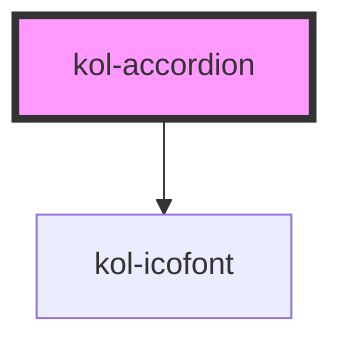

# kol-accordion

<!-- Auto Generated Below -->

## Properties

| Property | Attribute | Description                             | Type                   | Default |
| -------- | --------- | --------------------------------------- | ---------------------- | ------- |
| `_open`  | `_open`   | Gibt an, ob das Accordeon geöffnet ist. | `boolean \| undefined` | `false` |

## Dependencies

### Depends on

- [kol-icofont](../icofont)

### Graph

----------------------------------------------

