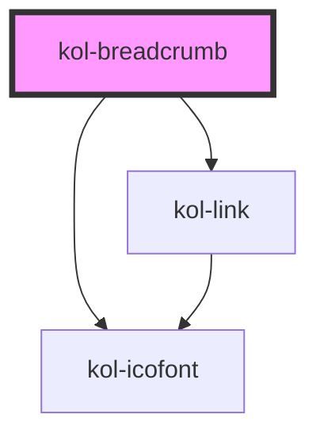

# kol-breadcrumb

<!-- Auto Generated Below -->

## Properties

| Property              | Attribute | Description                                                                                                                                                                                             | Type                                      | Default     |
| --------------------- | --------- | ------------------------------------------------------------------------------------------------------------------------------------------------------------------------------------------------------- | ----------------------------------------- | ----------- |
| `_crumbs`             | `_crumbs` | **[DEPRECATED]** Property wird im RC-Stadium entfernt. Es soll das _links-Property verwendet werden.  Gibt die geordnete Liste der Seitenhierarchie in Links an. | `BreadcrumbLink[] \| string \| undefined` | `undefined` |
| `_links` _(required)_ | `_links`  | Gibt die geordnete Liste der Seitenhierarchie in Links an.                                                                                                                                              | `BreadcrumbLink[] \| string`              | `undefined` |

## Dependencies

### Depends on

- [kol-icofont](../icofont)
- [kol-link](../link)

### Graph

----------------------------------------------

