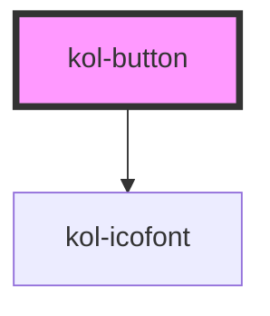

# kol-button

<!-- Auto Generated Below -->

## Properties

| Property              | Attribute     | Description                                                                                                                                                                                          | Type                                                 | Default     |
| --------------------- | ------------- | ---------------------------------------------------------------------------------------------------------------------------------------------------------------------------------------------------- | ---------------------------------------------------- | ----------- |
| `_disabled`           | `_disabled`   | Gibt an, ob das Button deaktiviert ist.                                                                                                                                                              | `boolean \| undefined`                               | `false`     |
| `_icon`               | `_icon`       | Gibt einen Identifier eines Icons aus den Icofont's an. (https://icofont.com/)                                                                                                                       | `Icofont \| undefined`                               | `undefined` |
| `_iconAlign`          | `_icon-align` | Gibt an, ob das Icon links, rechts, oben oder unten dargestellt werden soll.                                                                                                                         | `"left" \| "right" \| undefined`                     | `'left'`    |
| `_iconOnly`           | `_icon-only`  | Gibt an, ob nur das Icon angezeigt wird.                                                                                                                                                             | `boolean \| undefined`                               | `false`     |
| `_label` _(required)_ | `_label`      | Gibt den Label für die Beschriftung der Schaltfläche an.                                                                                                                                             | `string`                                             | `undefined` |
| `_minWidth`           | `_min-width`  | Gibt die Mindesbreite des Buttons an.                                                                                                                                                                | `string \| undefined`                                | `'unset'`   |
| `_on` _(required)_    | --            | Gibt die Callback-Funktionen für das Button-Events an.                                                                                                                                               | `{ onClick?: KoliBriCallback<Event> \| undefined; }` | `undefined` |
| `_text`               | `_text`       | **[DEPRECATED]** Property wird im RC-Stadium entfernt. Es soll das _label-Property verwendet werden.  Gibt den Text für die Beschriftung der Schaltfläche an. | `string \| undefined`                                | `undefined` |

## Dependencies

### Depends on

- [kol-icofont](../icofont)

### Graph

----------------------------------------------

