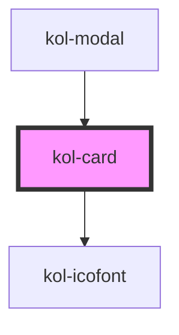

# kol-card

<!-- Auto Generated Below -->

## Properties

| Property                 | Attribute     | Description                                               | Type                                | Default     |
| ------------------------ | ------------- | --------------------------------------------------------- | ----------------------------------- | ----------- |
| `_hasCloser`             | `_has-closer` | Gibt an, ob die Card ein Schließen-Icon hat.              | `boolean \| undefined`              | `undefined` |
| `_hasFooter`             | `_has-footer` | Gibt an, ob die Card einen Footer-Bereich hat.            | `boolean \| undefined`              | `undefined` |
| `_headline` _(required)_ | `_headline`   | Gibt die Überschrift der Card an.                         | `string`                            | `undefined` |
| `_maxHeight`             | `_max-height` | Gibt die maximale Höhe des Inhaltsbereichs der Card an.   | `string \| undefined`               | `undefined` |
| `_onClose`               | --            | Gibt die Callback-Function für das Schließen der Card an. | `((t: Event) => void) \| undefined` | `undefined` |

## Dependencies

### Used by

 - [kol-modal](../modal)

### Depends on

- [kol-icofont](../icofont)

### Graph

----------------------------------------------

