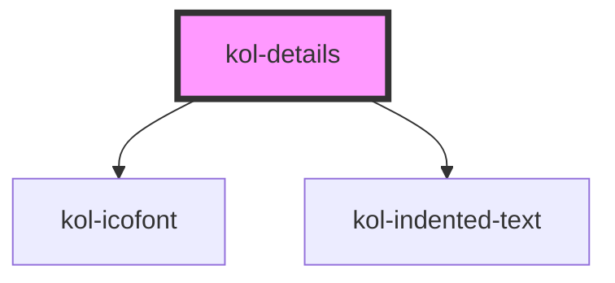

# kol-details

<!-- Auto Generated Below -->

## Properties

| Property | Attribute | Description                                                                       | Type                   | Default |
| -------- | --------- | --------------------------------------------------------------------------------- | ---------------------- | ------- |
| `_open`  | `_open`   | Gibt an, ob das Detail geöffnet ist.  TODO: Wie gehen wir mit Standardwerten um?! | `boolean \| undefined` | `false` |

## Dependencies

### Depends on

- [kol-icofont](../icofont)
- [kol-indented-text](../indented-text)

### Graph

----------------------------------------------

