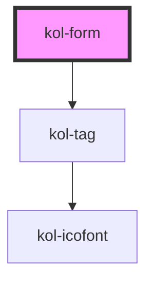

# kol-form

<!-- Auto Generated Below -->

## Properties

| Property       | Attribute       | Description                                                   | Type                   | Default     |
| -------------- | --------------- | ------------------------------------------------------------- | ---------------------- | ----------- |
| `_hasRequired` | `_has-required` | Gibt an, ob der Pflichtfeld-Hinweis eingeblendet werden soll. | `boolean \| undefined` | `undefined` |

## Dependencies

### Depends on

- [kol-tag](../tag)

### Graph

----------------------------------------------

