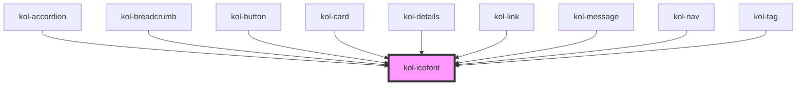

# kol-icofont

<!-- Auto Generated Below -->

## Properties

| Property             | Attribute     | Description                                                                    | Type                  | Default     |
| -------------------- | ------------- | ------------------------------------------------------------------------------ | --------------------- | ----------- |
| `_ariaLabel`         | `_aria-label` | Gibt das Aria-Label am Icon an.                                                | `string \| undefined` | `''`        |
| `_icon` _(required)_ | `_icon`       | Gibt einen Identifier eines Icons aus den Icofont's an. (https://icofont.com/) | `Icofont`             | `undefined` |

## Dependencies

### Used by

 - [kol-accordion](../accordion)
 - [kol-breadcrumb](../breadcrumb)
 - [kol-button](../button)
 - [kol-card](../card)
 - [kol-details](../details)
 - [kol-link](../link)
 - [kol-message](../message)
 - [kol-nav](../nav)
 - [kol-tag](../tag)

### Graph

----------------------------------------------

