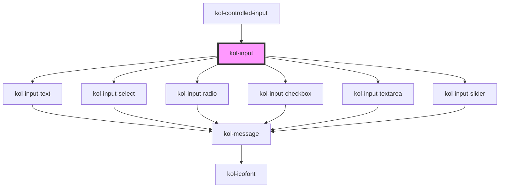

# kol-input

<!-- Auto Generated Below -->

## Properties

| Property              | Attribute           | Description                                                                    | Type                                                                                                                                                                                                                                                                                                               | Default     |
| --------------------- | ------------------- | ------------------------------------------------------------------------------ | ------------------------------------------------------------------------------------------------------------------------------------------------------------------------------------------------------------------------------------------------------------------------------------------------------------------ | ----------- |
| `_accept`             | `_accept`           |                                                                                | `string \| undefined`                                                                                                                                                                                                                                                                                              | `undefined` |
| `_disabled`           | `_disabled`         | Gibt an, ob das Eingabefeld aktiviert oder deaktiviert ist.                    | `boolean \| undefined`                                                                                                                                                                                                                                                                                             | `undefined` |
| `_error`              | `_error`            | Gibt den Text für eine Fehlermeldung an.                                       | `string \| undefined`                                                                                                                                                                                                                                                                                              | `undefined` |
| `_formNoValidate`     | `_form-no-validate` |                                                                                | `boolean \| undefined`                                                                                                                                                                                                                                                                                             | `undefined` |
| `_id` _(required)_    | `_id`               | Gibt die technische ID des Eingabefeldes an.                                   | `string`                                                                                                                                                                                                                                                                                                           | `undefined` |
| `_info`               | `_info`             | Gibt den Text für eine Infomeldung an.                                         | `string \| undefined`                                                                                                                                                                                                                                                                                              | `undefined` |
| `_label` _(required)_ | `_label`            | Gibt den Label-Text an.                                                        | `string`                                                                                                                                                                                                                                                                                                           | `undefined` |
| `_list`               | `_list`             |                                                                                | `string \| undefined`                                                                                                                                                                                                                                                                                              | `undefined` |
| `_mandatory`          | `_mandatory`        | Gibt an, ob zwingend eine Eingabe für das Eingabefeld erwartet wird.           | `boolean \| undefined`                                                                                                                                                                                                                                                                                             | `undefined` |
| `_max`                | `_max`              |                                                                                | `Date \| number \| undefined`                                                                                                                                                                                                                                                                                      | `undefined` |
| `_maxlength`          | `_maxlength`        |                                                                                | `number \| undefined`                                                                                                                                                                                                                                                                                              | `undefined` |
| `_min`                | `_min`              |                                                                                | `Date \| number \| undefined`                                                                                                                                                                                                                                                                                      | `undefined` |
| `_minlength`          | `_minlength`        |                                                                                | `number \| undefined`                                                                                                                                                                                                                                                                                              | `undefined` |
| `_name` _(required)_  | `_name`             | Gibt den technischen Namen des Eingabefeldes an.                               | `string`                                                                                                                                                                                                                                                                                                           | `undefined` |
| `_on`                 | --                  | Gibt die Callback-Funktionen für das Input-Events an.                          | `undefined \| { onBlur?: KoliBriCallback<Event> \| undefined; onClick?: KoliBriCallback<Event> \| undefined; onChange?: KoliBriCallback<Event> \| undefined; onFocus?: KoliBriCallback<Event> \| undefined; onInput?: KoliBriCallback<Event> \| undefined; }`                                                      | `undefined` |
| `_options`            | `_options`          | Gibt Optionen für Auswahlfelder an.                                            | `string \| undefined`                                                                                                                                                                                                                                                                                              | `undefined` |
| `_placeholder`        | `_placeholder`      | Gibt den Placeholder-Text an.                                                  | `string \| undefined`                                                                                                                                                                                                                                                                                              | `undefined` |
| `_readonly`           | `_readonly`         | Gibt an, ob das Eingabefeld nur gelesen werden kann.                           | `boolean \| undefined`                                                                                                                                                                                                                                                                                             | `undefined` |
| `_setValue`           | --                  |                                                                                | `((t: string \| number \| boolean) => void) \| undefined`                                                                                                                                                                                                                                                          | `undefined` |
| `_step`               | `_step`             |                                                                                | `number \| undefined`                                                                                                                                                                                                                                                                                              | `undefined` |
| `_success`            | `_success`          | Gibt den Text für eine Erfolgsmeldung an.                                      | `string \| undefined`                                                                                                                                                                                                                                                                                              | `undefined` |
| `_touched`            | `_touched`          | Gibt an, ob das Formular in dem dieses Feld eingebunden ist, abgesendet wurde. | `boolean \| undefined`                                                                                                                                                                                                                                                                                             | `undefined` |
| `_type`               | `_type`             | Gibt den Typ des Eingabefeldes an.                                             | `CharBasedInputType.date \| CharBasedInputType.email \| CharBasedInputType.number \| CharBasedInputType.password \| CharBasedInputType.range \| CharBasedInputType.text \| CharBasedInputType.textarea \| OptionBasedInputType.checkbox \| OptionBasedInputType.radio \| OptionBasedInputType.select \| undefined` | `undefined` |
| `_value`              | `_value`            | Gibt den Standartwert des Eingabefeldes an.                                    | `boolean \| number \| string \| undefined`                                                                                                                                                                                                                                                                         | `undefined` |
| `_warning`            | `_warning`          | Gibt den Text für eine Warnmeldung an.                                         | `string \| undefined`                                                                                                                                                                                                                                                                                              | `undefined` |

## Methods

### `_focus() => Promise<any>`

#### Returns

Type: `Promise<any>`

## Dependencies

### Used by

 - [kol-controlled-input](.)

### Depends on

- [kol-input-text](../input-text)
- [kol-input-select](../input-select)
- [kol-input-radio](../input-radio)
- [kol-input-checkbox](../input-checkbox)
- [kol-input-textarea](../input-textarea)
- [kol-input-slider](../input-slider)

### Graph

----------------------------------------------

