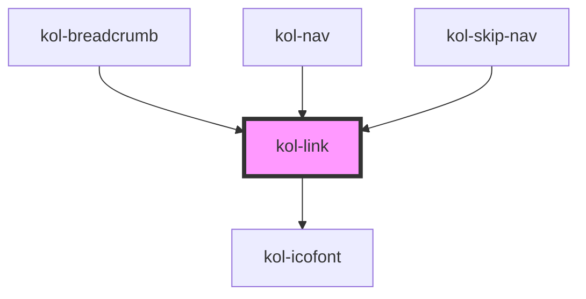

# kol-link

<!-- Auto Generated Below -->

## Properties

| Property     | Attribute     | Description                                                                    | Type                                                              | Default     |
| ------------ | ------------- | ------------------------------------------------------------------------------ | ----------------------------------------------------------------- | ----------- |
| `_ariaLabel` | `_aria-label` | Gibt den Titel des Links an.                                                   | `string \| undefined`                                             | `''`        |
| `_display`   | `_display`    | Gibt an, welcher Display-Mode für den Link angewendet wird.                    | `"block" \| "inline" \| "inline-block" \| undefined`              | `'inline'`  |
| `_fill`      | `_fill`       | Gibt an, ob der Link über die gesamte zur Verfügung stehende Breite ausfüllt.  | `boolean \| undefined`                                            | `false`     |
| `_href`      | `_href`       | Gibt die Ziel-Url des Links an.                                                | `string \| undefined`                                             | `''`        |
| `_icon`      | `_icon`       | Gibt einen Identifier eines Icons aus den Icofont's an. (https://icofont.com/) | `Icofont \| undefined`                                            | `undefined` |
| `_iconAlign` | `_icon-align` | Gibt an, ob das Icon links, rechts, oben oder unten dargestellt werden soll.   | `"left" \| "right" \| undefined`                                  | `'left'`    |
| `_iconOnly`  | `_icon-only`  | Gibt an, ob nur das Icon angezeigt wird.                                       | `boolean \| undefined`                                            | `false`     |
| `_on`        | --            | Gibt die Callback-Funktionen für den Link an.                                  | `undefined \| { onClick?: KoliBriCallback<Event> \| undefined; }` | `undefined` |
| `_stealth`   | `_stealth`    | Gibt an, ob der Link nur beim Fokus sichtbar ist.                              | `boolean \| undefined`                                            | `false`     |
| `_target`    | `_target`     | Definiert das Verhalten wo der Link geöffnet werden soll.                      | `string \| undefined`                                             | `'_self'`   |
| `_underline` | `_underline`  | Gibt an, ob die Links unterstrichen dargestellt werden.                        | `boolean \| undefined`                                            | `false`     |
| `_useCase`   | `_use-case`   | Gibt den Fall der Verwendung des Links an.                                     | `"image" \| "text" \| undefined`                                  | `'text'`    |

## Dependencies

### Used by

 - [kol-breadcrumb](../breadcrumb)
 - [kol-nav](../nav)
 - [kol-skip-nav](../skip-nav)

### Depends on

- [kol-icofont](../icofont)

### Graph

----------------------------------------------

