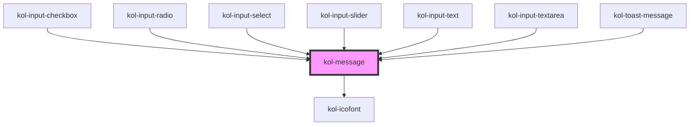

# kol-message

<!-- Auto Generated Below -->

## Properties

| Property             | Attribute    | Description                                                                                | Type                                                       | Default     |
| -------------------- | ------------ | ------------------------------------------------------------------------------------------ | ---------------------------------------------------------- | ----------- |
| `_alert`             | `_alert`     | Gibt an, ob der Screenreader die Meldung vorlesen soll.                                    | `boolean \| undefined`                                     | `undefined` |
| `_heading`           | `_heading`   | Gibt den Titel der Meldung an.                                                             | `string \| undefined`                                      | `undefined` |
| `_showIcon`          | `_show-icon` | Gibt an, ob die Meldung ein führendes Icon hat.                                            | `boolean \| undefined`                                     | `undefined` |
| `_text` _(required)_ | `_text`      | Gibt den Text der Meldung an.                                                              | `string`                                                   | `undefined` |
| `_type`              | `_type`      | Gibt an, ob es sich um entweder eine Erfolgs-, Info-, Warnung- oder Fehlermeldung handelt. | `"error" \| "info" \| "success" \| "warning" \| undefined` | `undefined` |

## Dependencies

### Used by

 - [kol-input-checkbox](../input-checkbox)
 - [kol-input-radio](../input-radio)
 - [kol-input-select](../input-select)
 - [kol-input-slider](../input-slider)
 - [kol-input-text](../input-text)
 - [kol-input-textarea](../input-textarea)
 - [kol-toast-message](../toast-message)

### Depends on

- [kol-icofont](../icofont)

### Graph

----------------------------------------------

