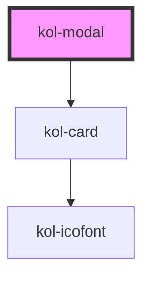

# kol-modal

<!-- Auto Generated Below -->

## Properties

| Property                 | Attribute     | Description                                                 | Type                                | Default     |
| ------------------------ | ------------- | ----------------------------------------------------------- | ----------------------------------- | ----------- |
| `_hasCloser`             | `_has-closer` | Gibt an, ob das Modal ein Schließen-Icon hat.               | `boolean \| undefined`              | `undefined` |
| `_hasFooter`             | `_has-footer` | Gibt an, ob die Modal einen Footer-Bereich hat.             | `boolean \| undefined`              | `undefined` |
| `_headline` _(required)_ | `_headline`   | Gibt die Überschrift des Modals an.                         | `string`                            | `undefined` |
| `_onClose`               | --            | Gibt die Callback-Function für das Schließen des Modals an. | `((t: Event) => void) \| undefined` | `undefined` |
| `_show`                  | `_show`       | Gibt an, ob das Modal eingeblendet ist.                     | `boolean \| undefined`              | `undefined` |

## Dependencies

### Depends on

- [kol-card](../card)

### Graph

----------------------------------------------

