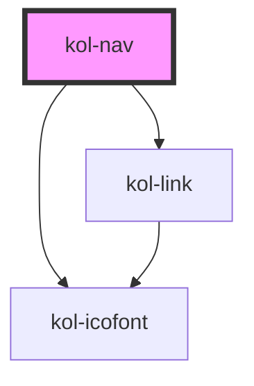

# kol-nav

<!-- Auto Generated Below -->

## Properties

| Property              | Attribute       | Description                                                                        | Type                             | Default     |
| --------------------- | --------------- | ---------------------------------------------------------------------------------- | -------------------------------- | ----------- |
| `_accentAlign`        | `_accent-align` | Gibt an, ob die Markierung links, rechts, oben oder unten dargestellt werden soll. | `"left" \| "right" \| undefined` | `undefined` |
| `_compact`            | `_compact`      | Gibt an, die Navigation kompakt angezeigt wird.                                    | `boolean \| undefined`           | `undefined` |
| `_links` _(required)_ | `_links`        | Gibt die geordnete Liste der Seitenhierarchie an.                                  | `NavLink[] \| string`            | `undefined` |

## Dependencies

### Depends on

- [kol-link](../link)
- [kol-icofont](../icofont)

### Graph

----------------------------------------------

