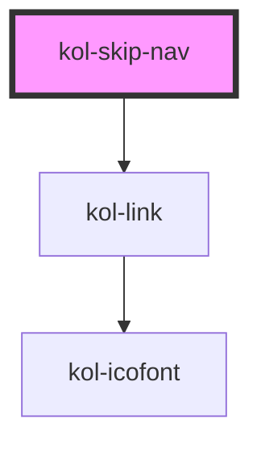

# kol-skip-nav

<!-- Auto Generated Below -->

## Properties

| Property              | Attribute | Description                                                                                                                                                                        | Type                      | Default     |
| --------------------- | --------- | ---------------------------------------------------------------------------------------------------------------------------------------------------------------------------------- | ------------------------- | ----------- |
| `_links` _(required)_ | `_links`  | Ist die Liste der unsichtbaren Links.                                                                                                                                              | `SkipNavLink[] \| string` | `undefined` |
| `_points`             | `_points` | **[DEPRECATED]** Property wird im RC-Stadium entfernt. Es soll das _links-Property verwendet werden.  Ist die Liste der unsichtbaren Links. | `string \| undefined`     | `undefined` |

## Dependencies

### Depends on

- [kol-link](../link)

### Graph

----------------------------------------------

