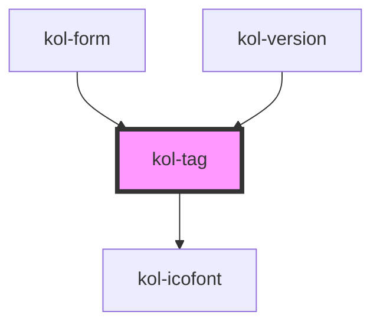

# kol-tag

<!-- Auto Generated Below -->

## Properties

| Property             | Attribute     | Description                                                                    | Type                             | Default                  |
| -------------------- | ------------- | ------------------------------------------------------------------------------ | -------------------------------- | ------------------------ |
| `_bold`              | `_bold`       | Gibt an, ob die Schrift fett sein soll.                                        | `boolean \| undefined`           | `undefined`              |
| `_color`             | `_color`      | Gibt die Farbe des Rahmens und der Schrift des Tags an.                        | `string`                         | `Nationalfarben.Schwarz` |
| `_icon`              | `_icon`       | Gibt einen Identifier eines Icons aus den Icofont's an. (https://icofont.com/) | `Icofont \| undefined`           | `undefined`              |
| `_iconAlign`         | `_icon-align` | Gibt an, ob das Icon links, rechts, oben oder unten dargestellt werden soll.   | `"left" \| "right" \| undefined` | `undefined`              |
| `_text` _(required)_ | `_text`       | Gibt den Text des Tags an.                                                     | `string`                         | `undefined`              |

## Dependencies

### Used by

 - [kol-form](../form)
 - [kol-version](../version)

### Depends on

- [kol-icofont](../icofont)

### Graph

----------------------------------------------

