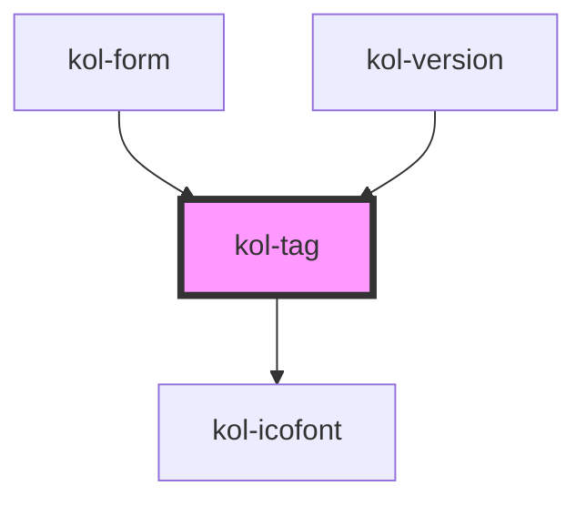

# kol-tag

<!-- Auto Generated Below -->

## Properties

| Property              | Attribute     | Description                                                                                                                                                                                  | Type                             | Default                  |
| --------------------- | ------------- | -------------------------------------------------------------------------------------------------------------------------------------------------------------------------------------------- | -------------------------------- | ------------------------ |
| `_bold`               | `_bold`       | **[DEPRECATED]** Property wird im RC-Stadium entfernt. Fett-Schrift kann von außen via CSS gesteuert werden.  Gibt an, ob die Schrift fett sein soll. | `boolean \| undefined`           | `undefined`              |
| `_color`              | `_color`      | Gibt die Farbe des Rahmens und der Schrift des Tags an.                                                                                                                                      | `string \| undefined`            | `Nationalfarben.Schwarz` |
| `_icon`               | `_icon`       | Gibt einen Identifier eines Icons aus den Icofont's an. (https://icofont.com/)                                                                                                               | `Icofont \| undefined`           | `undefined`              |
| `_iconAlign`          | `_icon-align` | Gibt an, ob das Icon links, rechts, oben oder unten dargestellt werden soll.                                                                                                                 | `"left" \| "right" \| undefined` | `'left'`                 |
| `_label` _(required)_ | `_label`      | Gibt den Label-Text des Tags an.                                                                                                                                                             | `string`                         | `undefined`              |
| `_text`               | `_text`       | **[DEPRECATED]** Property wird im RC-Stadium entfernt. Es soll das _label-Property verwendet werden.  Gibt den Text des Tags an.                      | `string \| undefined`            | `undefined`              |

## Dependencies

### Used by

 - [kol-form](../form)
 - [kol-version](../version)

### Depends on

- [kol-icofont](../icofont)

### Graph

----------------------------------------------

