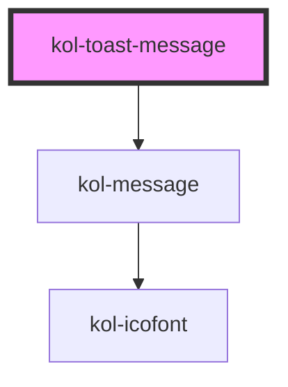

# kol-toast-message

<!-- Auto Generated Below -->

## Properties

| Property             | Attribute        | Description                                                                                | Type                                                       | Default     |
| -------------------- | ---------------- | ------------------------------------------------------------------------------------------ | ---------------------------------------------------------- | ----------- |
| `_alert`             | `_alert`         | Gibt an, ob der Screenreader die Meldung vorlesen soll.                                    | `boolean \| undefined`                                     | `undefined` |
| `_hasCloser`         | `_has-closer`    | Gibt an, ob die ToastMessage ein Schließen-Icon hat.                                       | `boolean \| undefined`                                     | `undefined` |
| `_heading`           | `_heading`       | Gibt den Titel der Meldung an.                                                             | `string \| undefined`                                      | `undefined` |
| `_icon`              | `_icon`          | Gibt einen Identifier eines Icons aus den Icofont's an. (https://icofont.com/)             | `Icofont \| undefined`                                     | `undefined` |
| `_show`              | `_show`          | Gibt an, ob die ToastMessage eingeblendet wird.                                            | `boolean \| undefined`                                     | `undefined` |
| `_showDuration`      | `_show-duration` | Gibt an, wie viele Millisekunden die ToastMessage eingeblendet werden soll.                | `number \| undefined`                                      | `undefined` |
| `_text` _(required)_ | `_text`          | Gibt den Text der Meldung an.                                                              | `string`                                                   | `undefined` |
| `_type`              | `_type`          | Gibt an, ob es sich um entweder eine Erfolgs-, Info-, Warnung- oder Fehlermeldung handelt. | `"error" \| "info" \| "success" \| "warning" \| undefined` | `undefined` |

## Dependencies

### Depends on

- [kol-message](../message)

### Graph

----------------------------------------------

