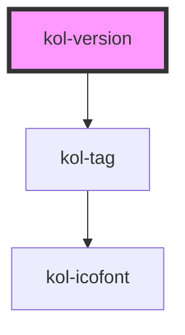

# kol-version

<!-- Auto Generated Below -->

## Properties

| Property                | Attribute  | Description                          | Type     | Default     |
| ----------------------- | ---------- | ------------------------------------ | -------- | ----------- |
| `_version` _(required)_ | `_version` | Gibt die Versionsnummer als Text an. | `string` | `undefined` |

## Dependencies

### Depends on

- [kol-tag](../tag)

### Graph

----------------------------------------------

